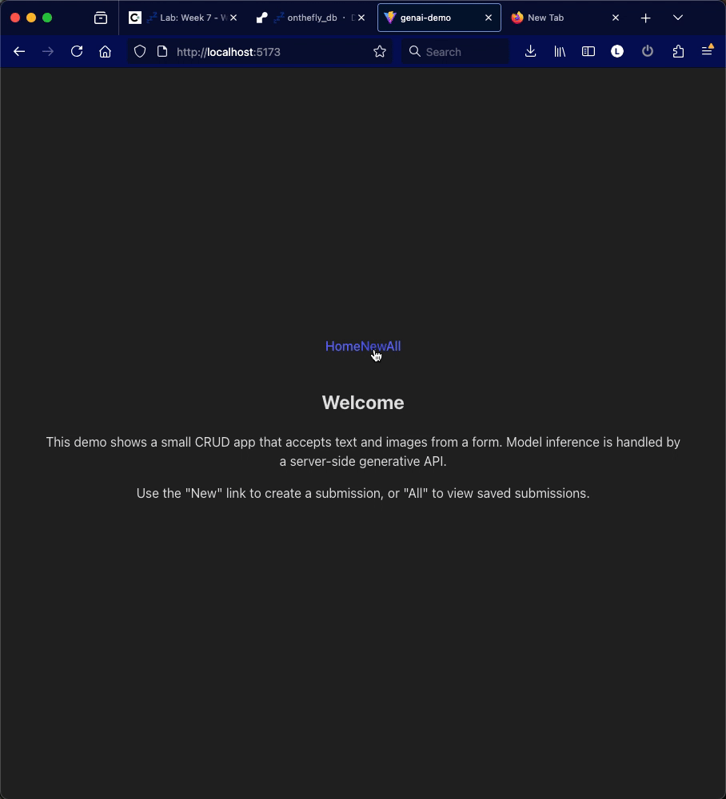

# Author

<Luis Ibarra>

# GeminiDemo — local client + GenAI proxy

This repository is a small demo that shows a Vite + React client talking to a local Node/Express proxy which forwards requests to Google's Generative Language (Gemini) APIs.

The instructions below will help you set up the project, provide environment variables, and run both the client and server locally for development.



## Prerequisites

- Node.js (16+ recommended)
- npm (comes with Node)
- A Google Generative Language API key (from Google AI Studio / Cloud Console)

## Project layout

- `client/` — Vite + React frontend (dev port: 5173)
- `server/` — local Express proxy that forwards requests to Google (listens on port 3001 by default)

## Environment variables

Create a `.env` file in the `server/` folder (do NOT commit it). You can copy the example below and fill in your API key.

server/.env

GOOGLE_API_KEY="your_real_google_api_key_here"

# Optionally set a port

PORT=3001

Important: If you've accidentally committed your API key, rotate it immediately. Never share your secret key in public repos or screenshots.

## Install dependencies

From the repository root run:

```bash
# install client deps
cd client
npm install

# install server deps
cd ../server
npm install
```

## Run locally (development)

Start the server (the exact script points to `server.js` by default):

```bash
cd server
# start the local proxy (dev)
npm run dev
```

Start the client in a separate terminal:

```bash
cd client
npm run dev
```

Now open the client URL (usually http://localhost:5173) in your browser. The client will send requests to the local proxy at http://localhost:3001/api/genai/generate.

If you changed the server port, update the client's dev base URL or proxy settings accordingly.

## How it works (high level)

- The client collects a prompt and model selection and calls a client-side utility which POSTs to `/api/genai/generate` on the local server.
- The server maps the incoming payload into a request shape the Google Generative Language API accepts (it supports a few shapes for different API versions), adds your API key, and forwards the request upstream.
- The server returns the upstream response (or a helpful error) back to the client.

## Troubleshooting

- Missing API key: the server will return an error if `GOOGLE_API_KEY` is not set — double-check `server/.env` and that you restarted the server after editing it.
